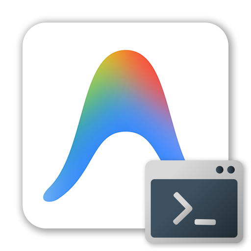
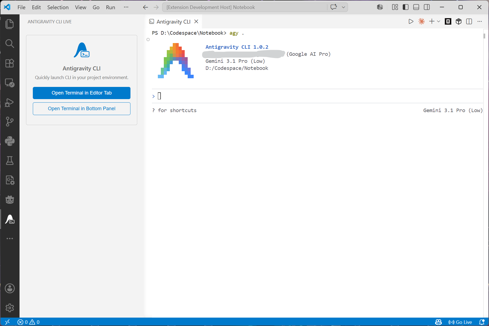

  

  # Antigravity CLI Live

  *Quickly launch and interact with the Antigravity CLI directly within your VS Code environment.*

  
  

## Overview

**Antigravity CLI Live** is a lightweight, flat-designed VS Code extension that streamlines your workflow by allowing you to launch your project's Antigravity CLI (`agy .`) instantly. It integrates deeply with your editor, allowing you to open the terminal in a traditional bottom panel or as a dedicated, full-size Editor Tab for maximum screen real estate.

## Features

- 🚀 **One-Click CLI Launch**: Start the Antigravity CLI environment instantly for the currently open project.
- 🗂️ **Editor Tab Integration**: Open the CLI terminal directly as a main Editor Tab (similar to modern AI coding assistants) for an immersive, distraction-free experience.
- ⏬ **Bottom Panel Support**: Alternatively, launch the CLI in the standard VS Code integrated terminal panel.
- ⚙️ **Configurable Command**: Customize the exact CLI command used to start the environment through extension settings.
- 🎨 **Clean & Native UI**: A flat, non-intrusive sidebar design built to look native in VS Code.

## Usage

1. Open a workspace or project folder in VS Code.
2. Click the **Antigravity CLI** icon in the Activity Bar on the left.
3. Choose your preferred launch method:
   - **Open Terminal in Editor Tab**: Best for focused CLI interaction.
   - **Open Terminal in Bottom Panel**: Best for side-by-side coding and CLI usage.
4. The terminal will automatically launch using your project's root directory.

## Extension Settings

This extension contributes the following settings:

* `antigravity-cli-live.cliCommand`: The command or script path used to run the Antigravity CLI. Defaults to `agy .`.

## Commands

You can also trigger these actions directly from the **Command Palette** (`Ctrl+Shift+P` / `Cmd+Shift+P`):

- `Antigravity CLI: Open Terminal in Editor Tab`
- `Antigravity CLI: Open Terminal in Bottom Panel`

## Requirements

- VS Code version `1.120.0` or higher.
- A workspace/folder must be opened to correctly set the terminal's working directory.

## License

[MIT](LICENSE)
